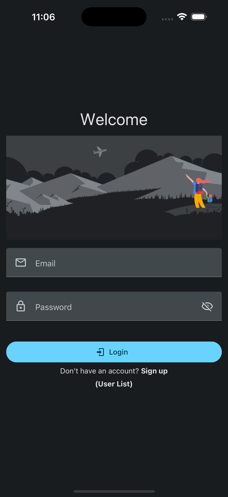
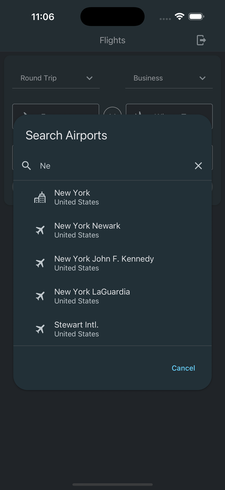
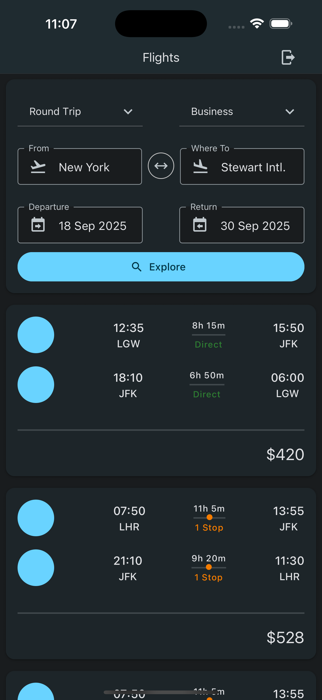
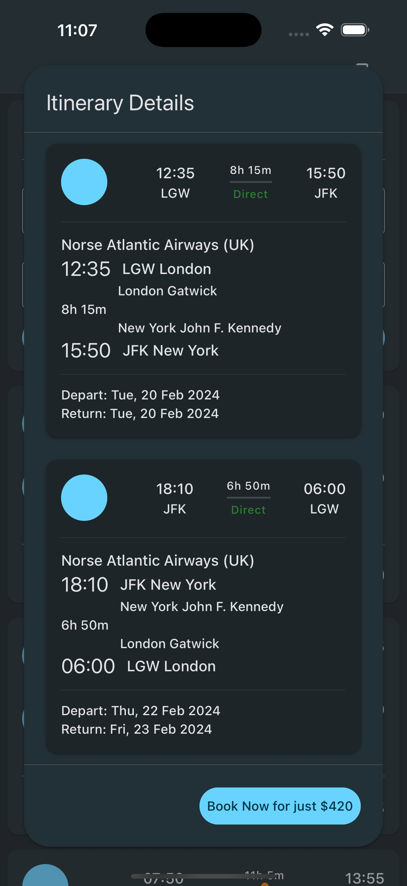

# rn-flights

## Description

React Native app that lets users search for flights (Similar to Google Flights)

This project is a simplified mobile version of Google Flights built with React Native. It allows users to sign up, search for flights by selecting origin, destination, and travel dates, and view flight options with relevant details. Flight data is powered by the Sky Scrapper API (via RapidAPI). To optimize the limited free quota of API calls, the project includes a mock service layer that enables switching between live API responses and locally stored sample data. The app demonstrates clean UI, API integration, authentication flow, and overall mobile development best practices within a time-constrained technical assessment.

---

## 📸 Screenshots

| Login                                                  | Airport Search                                         | Flight Search                                          | Flight Details                                         |
| ------------------------------------------------------ | ------------------------------------------------------ | ------------------------------------------------------ | ------------------------------------------------------ |
|  |  |  |  |

---

## ⚙️ Key Technologies Used

| Technology                                                                  | Description                                                                                               |
| --------------------------------------------------------------------------- | --------------------------------------------------------------------------------------------------------- |
| [React Native](https://reactnative.dev/)                                    | A framework for building native mobile apps using JavaScript and React.                                   |
| [Expo](https://expo.dev)                                                    | A development platform that streamlines building and deploying React Native apps.                         |
| [TypeScript](http://typescriptlang.org/)                                    | A strongly typed programming language that builds on JavaScript, providing better tooling at any scale.   |
| [AsyncStorage](https://github.com/react-native-async-storage/async-storage) | A simple, unencrypted, asynchronous key-value storage system for persisting data locally in React Native. |
| [Zustand](https://zustand-demo.pmnd.rs/)                                    | A small, fast and scalable bearbones state-management solution using simplified flux principles.          |
| [React Native Paper](https://reactnativepaper.com/)                         | A cross-platform UI component library that follows Material Design guidelines.                            |

---

## 🖥️ Environment setup

- Install [NodeJS](https://nodejs.org/en/) from installer or via [Homebrew](https://formulae.brew.sh/formula/node) for MacOS/Linux or [Chocolatey](https://community.chocolatey.org/packages/nodejs) for Windows.
- Verify `node` and `npm` commands from terminal: `node -v && npm -v`.
- (Optional) Install [`yarn`](https://yarnpkg.com/) package manager.

---

## 🛠️ Setup Instructions

### ⬇️ Clone repo

```bash
git clone https://github.com/YahyaBagia/rn-flights
```

### 📦 Install Packages

```bash
yarn # or npm install
```

### 🏁 Run Project

```bash
yarn ios # launches iOS simulator
# OR
yarn android # launches Android emulator
# OR
yarn web # launches Web Browser
```

---

## 🧩 Explanation

### 🔐 Authentication Features

- **Login:** Validates user credentials from a local in-memory list stored in `AsyncStorage`.
- **Signup:** Registers a new user (if not already existing) and appends them to the user list in `AsyncStorage`.
- **Logout:** Clears the session and navigates back to the auth screens.
- **Auto-login on App Launch:** Loads the persisted session if a user was previously logged in.

### 🧭 FLight API

- Uses [SkyScrapper](https://rapidapi.com/apiheya/api/sky-scrapper) API from [RapidAPI](https://rapidapi.com/)
- Has a mock layer that uses locally saved JSON files instead of calling the APIs.

---

## 📌 Notes

- Passwords are stored in plaintext for demonstration purposes only.
